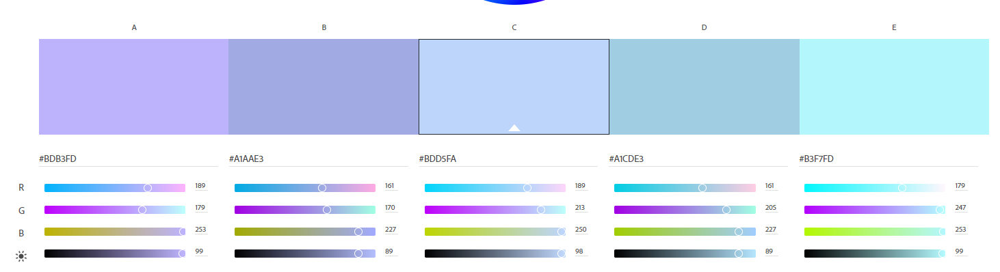

# ItmoWeb5Sem
***Сидорцов Владимир Сергеевич М33091*** 
### Тема: 
#### **скуки.net**
Сайт, где можно посмореть на возможные способы борьбы со скукой.  
Первоначальная идея состоит в том, чтобы иметь сайт, где описаны разные способы отдыха, о которых пишут люди. Активный и не очень отдых, спорт, хобби, секции. Каждая активность включает в себя описание, видео и фото, плюсы и минусы, необходимое оборудование, места, стоимостью. *(сюда можно включить комменты, обсуждения)*  
Также возможно добавление мероприятий, концертов, встреч, событий.

***Цветовая гамма, сгенерированная [Adobe Color](https://color.adobe.com/ru/create/color-wheel):***
  
Макет пока что выглядит так:

При наведении и задержке 2с на плиточке она раскрывается, где можно увидеть перелистывание фото (если их более 1), воспроизведение видео (если таковое имеется), краткое описание активности.  

> В будущем можно добавить:
- чаты, группы в соцсетях, сервера в дискорде для поиска единомышленников.
- комменты на активности, обсуждения.
- поддержку карт и поиск активностей, которые рядом с вами для больших возможностей.
- рекомендаторы активностей.
> На базе этого сайта можно построить платформу для книг, аниме, видео, игр.
